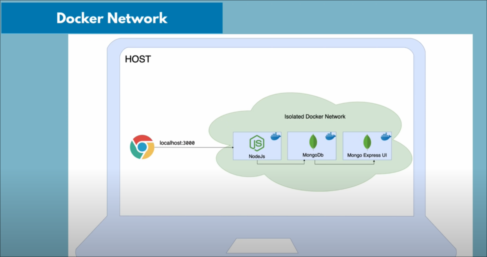

# Docker network diagram of the NodeJS project



Docker already has network built can be checked via 

```bash
docker network ls

[root@ArchLinuxASUSTUF Obsidian_Docker_Course]# docker network ls 
NETWORK ID     NAME      DRIVER    SCOPE
c438ca657c58   bridge    bridge    local
3ba7f85f7453   host      host      local
0cbb73eca83d   none      null      local

```

## How to create a docker network 

```bash
[root@ArchLinuxASUSTUF Obsidian_Docker_Course]# docker network create mongo-network
2b8a11145a874ded9227c161456245bfaba0e53b428cfd40c37d3a1160babbd1


[root@ArchLinuxASUSTUF Obsidian_Docker_Course]# docker network ls 
NETWORK ID     NAME            DRIVER    SCOPE
c438ca657c58   bridge          bridge    local
3ba7f85f7453   host            host      local
2b8a11145a87   mongo-network   bridge    local
0cbb73eca83d   none            null      local
[root@ArchLinuxASUSTUF Obsidian_Docker_Course]# 
```

## Create a mongo container with port 27017 with a default admin username and password 

```bash
docker run -d \
  --name mongodb \
  --network mongo-network \
  -p 27017:27017 \
  -e MONGO_INITDB_ROOT_USERNAME=admin \
  -e MONGO_INITDB_ROOT_PASSWORD=secret123 \
  mongo
afd773d160be8309059b3dcd80966edc4ee184895a0fee0a393a0c262435eb35
[root@ArchLinuxASUSTUF Obsidian_Docker_Course]# docker ps 
CONTAINER ID   IMAGE     COMMAND                  CREATED         STATUS         PORTS                             
                NAMES
afd773d160be   mongo     "docker-entrypoint.s…"   8 seconds ago   Up 2 seconds   0.0.0.0:27017->27017/tcp, [::]:270
17->27017/tcp   mongodb
```

## Create a mongo-express container 

```bash
docker run -d \
    --network mongo-network \
    --name mongo-express \
    -p 8081:8081 \
    -e ME_CONFIG_MONGODB_SERVER="mongodb" \
    -e ME_CONFIG_MONGODB_ADMINUSERNAME="admin" \
    -e ME_CONFIG_MONGODB_ADMINPASSWORD="secret123" \
    -e ME_CONFIG_BASICAUTH_USERNAME="admin" \
    -e ME_CONFIG_BASICAUTH_PASSWORD="secret123" \
    mongo-express
```


For additional commands check this note [[Docker_commands_3]]
