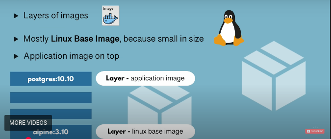

# What is a Image 

An image is a set of instructions that result in creation of container 

Think of a Docker image as a blueprint or recipe. It is a read-only template.

Contains everything needed to run a piece of software:

-   Your application code,
-   System tools,
-   Libraries,
-   Settings, etc.
-   Built from a Dockerfile.

# What is a container 

A container is a running instance of an image.

It's like a virtual machine, but much lighter.

It's based on an image, but you can run, modify, stop, or delete it.

When you start a container, Docker uses the image as the starting point.

## Container structure 

